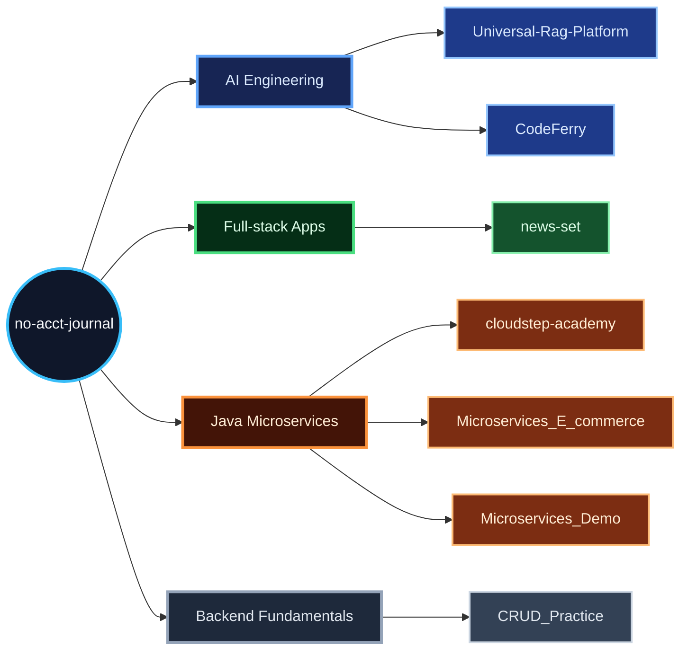

<p align="center">
  
</p>

<p align="center">
  <a href="https://github.com/no-acct-journal">
    
  </a>
  
  
  
</p>

I build backend systems, AI-enabled developer tools, and full-stack product prototypes.
My repositories are mostly hands-on systems work: FastAPI services, RAG pipelines,
terminal coding agents, Vue applications, and Java/Spring Cloud microservice architectures.

```txt
Current operating mode:

  Design the system clearly.
  Build the smallest version that proves the architecture.
  Add observability, permissions, evaluation, and automation where they matter.
```

## GitHub Activity

<p align="center">
  
</p>

## What I'm Building Around

<table>
  <tr>
    <th width="190">Area</th>
    <th>Current focus</th>
  </tr>
  <tr>
    <td><strong>RAG&nbsp;platforms</strong></td>
    <td>ingestion, parsing, chunking, hybrid retrieval, QA, source sync, permissions, background jobs, evaluation</td>
  </tr>
  <tr>
    <td><strong>AI&nbsp;developer&nbsp;tools</strong></td>
    <td>streaming agent loops, tool execution, permission models, sessions, memory, skills, sub-agents, worktrees, MCP</td>
  </tr>
  <tr>
    <td><strong>Java&nbsp;microservices</strong></td>
    <td>Spring Boot, Spring Cloud, API gateways, Feign clients, service discovery, shared modules, service boundaries</td>
  </tr>
  <tr>
    <td><strong>Full-stack&nbsp;apps</strong></td>
    <td>Vue 3, FastAPI, PostgreSQL, Redis, Docker Compose, auth, caching, mobile-first flows</td>
  </tr>
</table>

## Featured Work

<table>
  <tr>
    <td width="50%">
      <h3><a href="https://github.com/no-acct-journal/Universal-Rag-Platform">Universal-Rag-Platform</a></h3>
      <p>
        General-purpose RAG backend with document ingestion, parser registry, chunking,
        sparse/hybrid retrieval, QA, source sync, permissions, job tracking, and evaluation modules.
      </p>
      <p>
        
        
        
        
      </p>
    </td>
    <td width="50%">
      <h3><a href="https://github.com/no-acct-journal/CodeFerry">CodeFerry</a></h3>
      <p>
        Terminal AI coding assistant with streaming UI, multi-provider LLM support,
        built-in tools, permissions, sessions, memory, skills, sub-agents, hooks, and MCP tools.
      </p>
      <p>
        
        
        
        
      </p>
    </td>
  </tr>
  <tr>
    <td width="50%">
      <h3><a href="https://github.com/no-acct-journal/news-set">news-set</a></h3>
      <p>
        Full-stack news reading app with category feeds, article details, authentication,
        favorites, browsing history, Redis caching, and an AI chat proxy.
      </p>
      <p>
        
        
        
        
      </p>
    </td>
    <td width="50%">
      <h3><a href="https://github.com/no-acct-journal/cloudstep-academy">cloudstep-academy</a></h3>
      <p>
        Maven multi-module online learning platform organized around auth, gateway,
        users, courses, learning, exams, media, search, messages, payments, orders, and reviews.
      </p>
      <p>
        
        
        
        
      </p>
    </td>
  </tr>
</table>

## Project Index

| Project | What it demonstrates | Stack |
| --- | --- | --- |
| [Universal-Rag-Platform](https://github.com/no-acct-journal/Universal-Rag-Platform) | RAG backend with ingestion, parsing, chunking, retrieval, QA, permissions, job tracking, and evaluation. | Python, FastAPI, SQLAlchemy, PostgreSQL, Redis, Milvus/Zilliz |
| [CodeFerry](https://github.com/no-acct-journal/CodeFerry) | Terminal AI coding assistant with streaming UI, tools, permission checks, sessions, memory, skills, sub-agents, hooks, and MCP. | Python, Textual, Anthropic API, OpenAI API, MCP |
| [news-set](https://github.com/no-acct-journal/news-set) | Full-stack news reading app with auth, favorites, history, caching, and AI chat proxy. | Vue 3, Vite, FastAPI, PostgreSQL, Redis, Docker Compose |
| [cloudstep-academy](https://github.com/no-acct-journal/cloudstep-academy) | Multi-module online learning microservice platform with domain-oriented services. | Java 11, Spring Boot, Spring Cloud, MyBatis-Plus, MySQL, Redis, Elasticsearch, Docker |
| [Microservices_E_commerce_Platform](https://github.com/no-acct-journal/Microservices_E_commerce_Platform) | Monolith-to-microservices e-commerce architecture with gateway, shared modules, clients, JWT filtering, and Feign calls. | Java, Spring Boot, Spring Cloud, MyBatis, Docker |
| [Microservices_Demo](https://github.com/no-acct-journal/Microservices_Demo) | Compact microservices learning project covering discovery, gateway routing, OpenFeign, users, and orders. | Java, Spring Cloud, Eureka, Gateway, OpenFeign |
| [CRUD_Practice](https://github.com/no-acct-journal/CRUD_Practice) | Java CRUD backend practice with admin/user APIs, JWT auth, Redis, object storage utilities, and report DTO/VO design. | Java, Spring Boot, MyBatis, Redis, JWT |

## Technical Toolbox

<p>
  
</p>

| Category | Tools |
| --- | --- |
| Languages | Python, Java, JavaScript |
| Backend | FastAPI, Spring Boot, Spring Cloud, SQLAlchemy, MyBatis, MyBatis-Plus |
| Frontend | Vue 3, Vite, Vant, Pinia, Vue Router, Axios |
| Data and infra | PostgreSQL, MySQL, Redis, Milvus/Zilliz, Elasticsearch, Docker Compose |
| AI engineering | RAG, embeddings, vector retrieval, sparse/hybrid retrieval, AI chat proxies, OpenAI-compatible APIs, Anthropic API, MCP tooling |
| Engineering practices | modular service design, API design, auth/permission boundaries, background jobs, evaluation flows, CLI tooling, developer automation |

## Repository Map



---

<p align="center">
  <sub>Building practical systems, one repo at a time.</sub>
</p>
